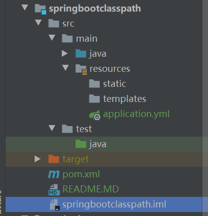

# Springboot classpath 
* 在 Springboot 创建以后，会生成一个工程名+iml 的文件。
* 该文件位于项目的根目录下
* 在该文件中，有 name="NewModuleRootManager" 的 component 声明中有 content 声明
    ```json
    <content url="file://$MODULE_DIR$">
      <sourceFolder url="file://$MODULE_DIR$/src/main/java" isTestSource="false" />
      <sourceFolder url="file://$MODULE_DIR$/src/main/resources" type="java-resource" />
      <sourceFolder url="file://$MODULE_DIR$/src/test/java" isTestSource="true" />
      <excludeFolder url="file://$MODULE_DIR$/target" />
    </content>
    ```
  * sourceFolder 声明的就是 classPath 
  * 工程目录如下    
    
    
  * /src/main/java：保存项目的java文件
  * /src/main/resources：项目的资源目录，里面通常包含static与templates目录
  * /src/test/java：编写的测试类的目录
  
* 工程编译后，会将src/main/java中的.java文件按照包文件结构编译成.class存入target/classes目录。
* 工程编译后，会将src/main/resources中的static、templates目录里的文件分别拷贝入classes/static 与classes/template 中。结构保持一致。
* 工程编译后，会将test/java 中的文件编译进classes/test-classes目录中。
* 可以根据项目需要，修改.iml文件的content，来添加不同的资源路径。
  

> https://www.jianshu.com/p/3f61ac9b0ec2
