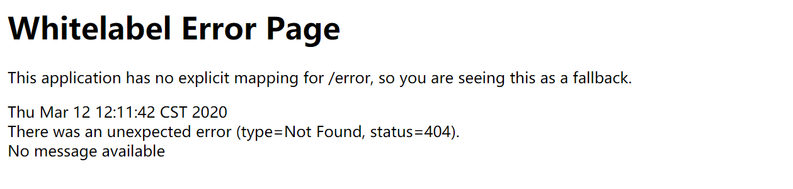
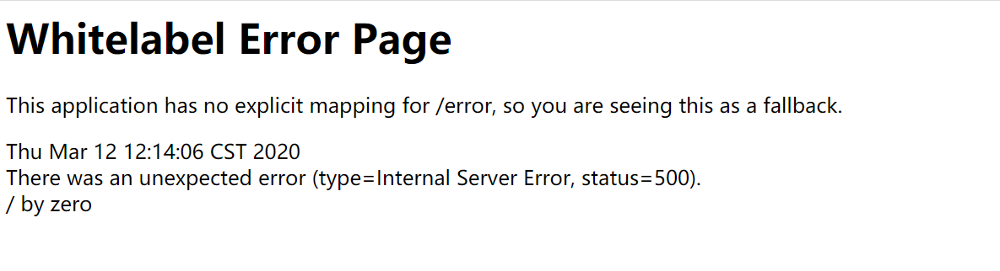
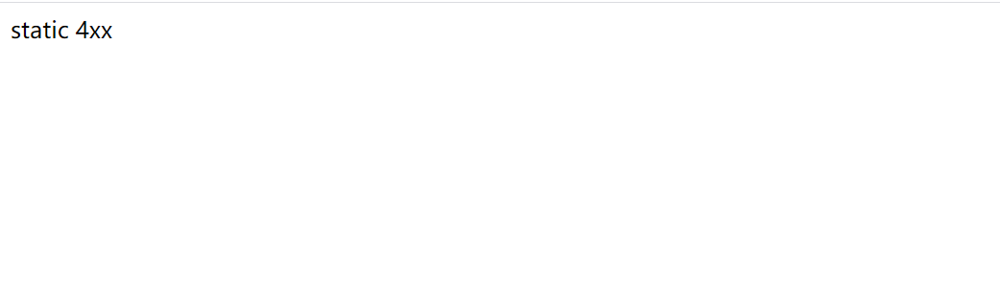
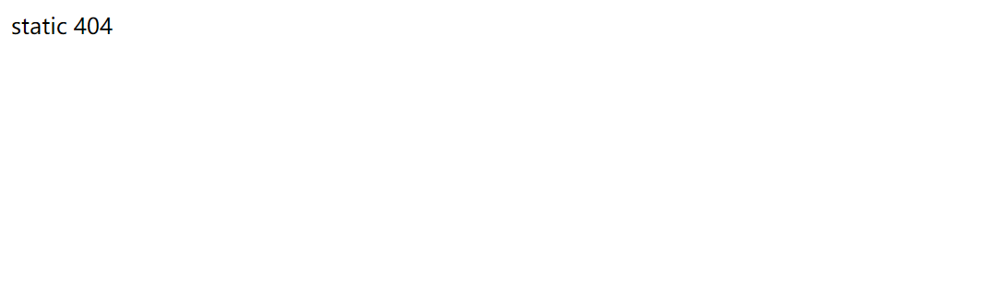
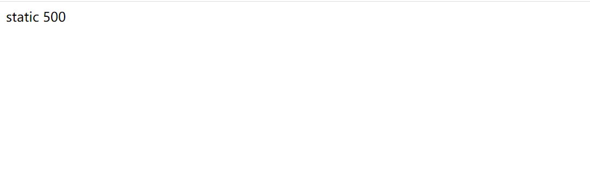
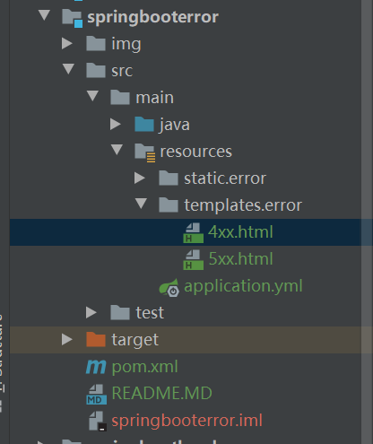
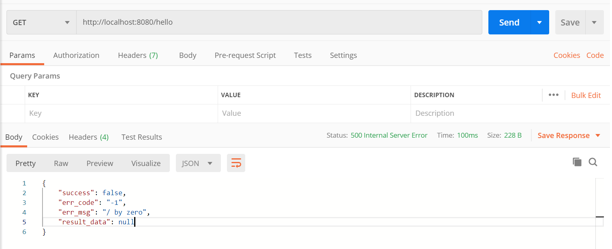

# Spring Boot 错误处理

## 应用层全局异常 @ControllerAdvice

## 全局错误 html
### Springboot 错误页
* Springboot 默认错误页
    * 404 默认错误页
        
    * 500 默认错误页
        

### 自定义错误页
##### 静态 HTML 页面展示
* 在不需要向用户展示详细的错误信息的情况下，可以把错误信息定义成静态页面
* resources/static 目录下创建 error 目录，然后创建错误静态页面
* 创建的静态 html 页面分为两种：
    * 4xx.html,5xx.html
    * 使用响应码命名文件，如 404.html,500.html
* 使用响应码的 html 静态页面比 4xx.html 的静态页面显示的更细，假如响应码能匹配到响应的 html 页面会展示该页面，假如没有会展示 4xx.html 这类页面
* 使用静态 html 页面展示
    * 404错误，无 404 页面，使用 4xx 页面    
        
    * 404    
        
    * 500    
        
##### HTML 模块页面展示
* 静态 html 页面无法向用户展示完整的错误信息，采用视图模板可以向用户展示更多的错误信息
* 采用视图模板以 Thymeleaf 为例
    1. pom 文件引入 Thymeleaf 依赖
        ```json
            <dependency>
                <groupId>org.springframework.boot</groupId>
                <artifactId>spring-boot-starter-thymeleaf</artifactId>
            </dependency>
        ```
    2. Thymeleaf 页面模板默认处于 `classpath:/templates/` 目录下，在该目录下创建 `error` 目录,目前结构如下   
        
    3. 页面模板 404 错误页
        
    4. 页面模板 4xx 错误页
        
    5. 页面模板 500 错误页
        
        


### 错误页面展示逻辑
1. 使用静态页面，没有使用模板，会到 static/error 目录下，先查找响应码对应的静态页面，没有的话，找响应码对应的码错误页，比如404页面没有，找4xx页面，最后使用系统的错误页
2. 使用模板，会到 templates 目录下查找，响应码对应的页面，比如404会先到 templates/error 目录下查找 404.html ,没有的话会在该目录下查找 4xx.html  ,没有的话，最后使用系统的错误页
3. 使用模板，出现了 404 错误， templates/error 没有 404.html，但是 static/error 目录下有 404.html ，这个时候会返回 static/error 下的 404.html 。在实际开发中，要不使用模板，要不就使用静态页面。


### Springboot 错误控制源码
* Springboot 的错误默认是由 `BasicErrorController` 类来处理的。
* 该类两个核心方放， `errorHtml()` 返回错误 html 页面，`error()` 返回错误 json
* 代码如下：
    ```java
        @RequestMapping(produces = "text/html")
        public ModelAndView errorHtml(HttpServletRequest request, HttpServletResponse response) {
            HttpStatus status = getStatus(request);
            Map<String, Object> model = Collections
                    .unmodifiableMap(getErrorAttributes(request, isIncludeStackTrace(request, MediaType.TEXT_HTML)));
            response.setStatus(status.value());
            ModelAndView modelAndView = resolveErrorView(request, response, status, model);
            return (modelAndView != null) ? modelAndView : new ModelAndView("error", model);
        }
    
        @RequestMapping
        public ResponseEntity<Map<String, Object>> error(HttpServletRequest request) {
            HttpStatus status = getStatus(request);
            if (status == HttpStatus.NO_CONTENT) {
                return new ResponseEntity<>(status);
            }
            Map<String, Object> body = getErrorAttributes(request, isIncludeStackTrace(request, MediaType.ALL));
            return new ResponseEntity<>(body, status);
        }
    ```
* 不论是 `error()` 还是 `errorHtml()` 方法的错误信息，都调用了父类 AbstractErrorController 的 getErrorAttributes() 方法获取到的，
    ```java
        protected Map<String, Object> getErrorAttributes(HttpServletRequest request, boolean includeStackTrace) {
            WebRequest webRequest = new ServletWebRequest(request);
            return this.errorAttributes.getErrorAttributes(webRequest, includeStackTrace);
        }
    ```
* `getErrorAttributes()` 方法调用了 `DefaultErrorAttributes` 的 `getErrorAttributes()` 方法，在该方法中，组合了错误方法中出现的5个参数 `timestamp`,`status`,`error`,`message`,`path`。需要自定义返回的数据，可以继承该类修改该方法。
    ```java
        public Map<String, Object> getErrorAttributes(WebRequest webRequest, boolean includeStackTrace) {
            Map<String, Object> errorAttributes = new LinkedHashMap();
            errorAttributes.put("timestamp", new Date());
            this.addStatus(errorAttributes, webRequest);
            this.addErrorDetails(errorAttributes, webRequest, includeStackTrace);
            this.addPath(errorAttributes, webRequest);
            return errorAttributes;
        }
    ```
### 自定义 error 数据和视图

#### 自定义 error 数据
* 通过源码可以知道错误信息数据是由 `DefaultErrorAttributes` 提供的。 `DefaultErrorAttributes` 是在 `ErrorMvcAutoConfiguration` 提供的。
    ```java
        @Bean
        @ConditionalOnMissingBean(value = ErrorAttributes.class, search = SearchStrategy.CURRENT)
        public DefaultErrorAttributes errorAttributes() {
            return new DefaultErrorAttributes(this.serverProperties.getError().isIncludeException());
        }
    ```
* 当系统没有提供 `ErrorAttributes` 时才会采用 `DefaultErrorAttributes`。因此自定义错误提示时，只需要提供一个 `ErrorAttributes`的实现类，或者继承 `DefaultErrorAttributes`，`DefaultErrorAttributes` 实现了 `ErrorAttributes`.
* 自定义 `MyErrorAttributes` ，重写 `getErrorAttributes` 方法
    ```java
    @Component
    public class MyErrorAttributes extends DefaultErrorAttributes {
    
        /**
         * 自定义错误返回的数据
         * {"success":false,"err_code":"x","err_msg":"","result_data":{}}
         */
        @Override
        public Map<String, Object> getErrorAttributes(WebRequest webRequest, boolean includeStackTrace) {
            Map<String, Object> errorAttributes = super.getErrorAttributes(webRequest, includeStackTrace);
            // 添加自定义的错误字段
            errorAttributes.put("success",false);
            errorAttributes.put("err_code","-1");
            errorAttributes.put("err_msg",errorAttributes.get("message"));
            errorAttributes.put("result_data",null);
            // 移除已有的错误字段
            errorAttributes.remove("error");
            errorAttributes.remove("timestamp");
            errorAttributes.remove("status");
            errorAttributes.remove("message");
            errorAttributes.remove("path");
            return errorAttributes;
        }
    }
    ```
* postman 请求如下：
 

#### 自定义 error 视图
* Error 视图是由 BasicErrorController 的 errorHtml 方法中调用 `resolveErrorView()` 方法获取 `ModelAndView` 实例。 
`resolveErrorView()` 方法由`ErrorViewResolver` 提供的，通过 `ErrorMvcAutoConfiguration` 源码可以看到 Springboot 默认采用的`ErrorViewResolver` 是 `DefaultErrorViewResolver`

* 代码如下：
    ```java
		@Bean
		@ConditionalOnBean(DispatcherServlet.class)
		@ConditionalOnMissingBean(ErrorViewResolver.class)
		DefaultErrorViewResolver conventionErrorViewResolver() {
			return new DefaultErrorViewResolver(this.applicationContext, this.resourceProperties);
		}
    ```
* 自定义 error 视图的话，只需要提供自定义的 `ErrorViewResolver`
### 全局配置

## 错误 json